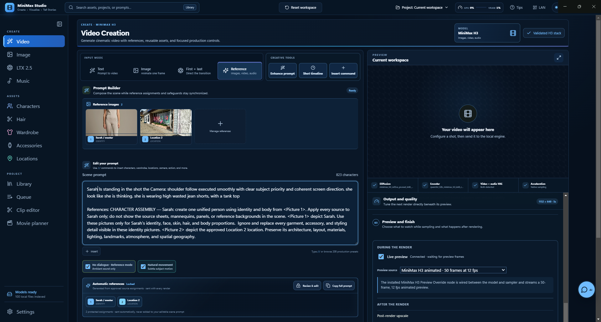

# MiniMax Studio

MiniMax Studio is a local-first AI filmmaking workstation for ComfyUI. It brings MiniMax H3 video, LTX 2.5 video, Z-Image stills, ACE-Step music, reusable production assets, and local rendering into one desktop workspace. Models are indexed and used in place: the application never downloads, copies, or reorganizes your model files.



> **Privacy by default:** prompts, media, models, output, and optional prompt enhancement remain on your workstation. LAN sharing is opt-in and token-protected.

## Quick start

1. Install **Node.js 20+** and **pnpm 10+**.
2. Install and start a current local **ComfyUI** instance with the provider nodes you intend to use.
3. Place the required model files in ComfyUI's model folders (or point MiniMax Studio to your existing folders in **Settings → Model locations**).
4. Install and run the app:

   ```powershell
   pnpm install
   pnpm dev
   ```

5. Open **Settings**, confirm the ComfyUI address (default `http://127.0.0.1:8188`), select **Test connection**, then **Rescan** model folders.
6. Choose **Video**, **Image**, **LTX 2.5**, or **Music**, add a prompt and any references, and generate locally.

The app reports which model stack components and ComfyUI nodes are available before a render is queued. A missing optional feature is shown as unavailable; a required base model prevents that provider from being used until it is installed.

## Current capabilities

- Text-to-video, image-to-video, and first/last-frame generation through the FL2VA model
- A separate LTX‑2.5 T2V/I2V workspace with native synchronized audio, live ComfyUI previews, an official two-stage quality preset, and a distilled single-stage Turbo preset
- A dedicated ACE‑Step 1.5 music workspace through ComfyUI, with XL SFT and XL Base checkpoint selection, lyric/instrumental modes, tempo/key/language controls, FLAC output, progress, cancellation, and in-app playback
- A global Character Studio: Z-Image master references, MiniMax I2V turntable handoff, five-angle frame extraction, single-image or reference-set selection, and one-click Movie Creator imports
- Mixed image, video, and audio references through the Ref2VA model
- A complete H3 stack report that separately verifies FL2VA, Ref2VA, and the detected FL2V/Ref2V Turbo LoRAs
- Automatic local vision-model descriptions for existing character, hair, wardrobe, accessory, and location reference images; authored fields are preserved
- Non-destructive Ref2V video clipping: preview a longer source, set precise in/out points, and create or revise a focused 2–15 second reference MP4 without changing the original
- Native synchronized video and stereo-audio decoding
- Official ComfyUI H3 graph topology and sampling defaults, with detected FL2V and Ref2V 4/8-step turbo LoRAs, including MiniMax H3 Turbo Ref2VA 8-Step v1.0 at 768p
- Two optional additional ComfyUI LoRA slots, each with an independent strength; official Turbo LoRAs remain automatic and do not consume a slot
- Optional H3 text encoding: fast NVFP4-AWQ remains the default; select the slower, higher-quality `qwen3vl_32b_minimax_h3_int8_convrot.safetensors` encoder when it is installed
- Local Ollama prompt enhancement, timed shot planning, and synchronized-audio rewriting
- In-app playback through a range-aware local media proxy, using either ComfyUI history or the configured output directory
- Z-Image Turbo first-frame generation using locally installed ComfyUI models
- Landscape, portrait, and square output presets plus validated custom 32-pixel-aligned dimensions, automatic image fitting, and an interactive crop preview
- Official `res_multistep` + `simple` sampling by default, an explicit full-quality experimental override, and WebSocket render progress/previews
- Persistent generation defaults with Native Quality, official Turbo 8, Preview, and separately disclosed experimental sampling controls
- Guided H3 Native Quality, Turbo 8, and Preview presets with resolution quality labels, validated official-stack reporting, and custom sampling isolated under an Experimental disclosure
- A fixed-seed H3 quality diagnostic that queues matching Native and Turbo 8 renders for direct A/B comparison
- Optional verified LTX 2.5 latent 2× post-processing for every MiniMax video mode; LTX-VAE encodes the completed frames, the learned latent upsampler doubles spatial size, and the app trims padding and retains untouched MiniMax audio
- A one-click, per-user NSIS Windows installer with desktop and Start menu shortcuts
- A same-network mobile companion for native MiniMax H3 or LTX‑2.5 T2V/I2V creation, separate provider state, automatic crop controls, video preview, and download
- A dedicated Z-Image Turbo first-frame workspace with persistent controls, local Ollama enhancement, cancellation, and direct I2V handoff
- Mobile and desktop live ComfyUI sampler steps, stage-aware progress, faster completion updates, Ollama prompt revision, cancellation, verified MiniMax post-render LTX 2.5 latent upscaling, and explicitly experimental RTX/CUDA frame upscaling

## Mobile companion

Select **LAN** in the title bar and scan the QR code from a device connected to the same trusted Wi-Fi or LAN. The sharing dialog presents two separate QR codes:

- **Touch-first mobile creation** for fast, phone-friendly shot creation and monitoring.
- **Complete Studio interface** for the full production workspace on a tablet or another desktop browser.

The private access token persists across desktop restarts, so saved links keep working. Use **Rotate access link** in the QR dialog whenever you want to invalidate every previously scanned link. Windows Firewall may ask whether the app can accept private-network connections the first time.

The phone uses the model folders, ComfyUI address, and output settings configured on the desktop. The first pass is served over local HTTP for simple LAN access. Browsers require a trusted HTTPS origin for verified PWA installation and service-worker caching, so the HTTP version should be used in the browser or saved as a home-screen shortcut until the guided HTTPS pass is complete.

## Local services

- ComfyUI defaults to `http://127.0.0.1:8188`.
- Ollama defaults to `http://127.0.0.1:11434`. The app lists installed local text models and deliberately excludes embedding and cloud-backed entries. Prompt text never needs to leave the workstation.

Both addresses, every model directory, and the ComfyUI output directory can be changed from Settings.

## Models and ComfyUI setup

MiniMax Studio indexes the folders configured in **Settings → Model locations**. The default root is `%USERPROFILE%\Documents\ComfyUI\models`; use the table below as the expected layout. Exact filenames are preferred, while compatible provider variants are detected where the UI says so.

### MiniMax H3 video (required for Video)

| ComfyUI folder | Required model |
| --- | --- |
| `models/diffusion_models` | `minimax_h3_fl2va_pruned_int8_convrot.safetensors` |
| `models/diffusion_models` | `minimax_h3_ref2va_pruned_int8_convrot.safetensors` |
| `models/text_encoders` | `qwen3vl_32b_minimax_h3_nvfp4_awq.safetensors` |
| `models/vae` | `minimax_h3_video_vae_fp16.safetensors` |
| `models/vae` | `minimax_h3_audio_vae_fp32.safetensors` |

For official H3 Turbo, also install `minimax_h3_fl2v_turbo_8step_v1.0_comfyui_bf16.safetensors` and `minimax_h3_ref2v_turbo_8step_v1.0_768p_comfyui_bf16.safetensors` in `models/loras`. The older `minimax_h3_ref2v_turbo_4step_v0.1_comfyui_bf16.safetensors` is optional. The slower quality encoder, `qwen3vl_32b_minimax_h3_int8_convrot.safetensors`, is optional and belongs in `models/text_encoders`; it is used only when selected in the app.

Animated H3 preview is optional. It requires a compatible MiniMax H3 Preview Override node and that node's compatible `taeh3_decoder.safetensors` in `models/vae_approx`. A decoder channel-shape warning generally means a same-named TAE from another package was selected.

### LTX 2.5 video (required for the LTX 2.5 workspace)

| ComfyUI folder | Required model |
| --- | --- |
| `models/diffusion_models` | `ltx-2.5-22b-distilled-transformer-comfy-int8-convrot.safetensors` |
| `models/text_encoders` | `gemma4-12b-with-proj-ltx-2.5-comfy-int8-convrot.safetensors` |
| `models/vae` | `ltx-2.5-video-vae-bf16.safetensors` |
| `models/vae` | `ltx-2.5-audio-vae-bf16.safetensors` |
| `models/latent_upscale_models` | `ltx-2.5-latent-spatial-upscaler-x2-bf16-1.0.safetensors` |

The app also recognizes compatible LTX transformer variants. The latent upscaler is needed for the official two-stage Quality preset and for verified LTX post-render 2× processing.

### ACE-Step 1.5 music (required for the Music workspace)

| ComfyUI folder | Required model |
| --- | --- |
| `models/diffusion_models` | `acestep_v1.5_xl_sft_bf16.safetensors` and/or `acestep_v1.5_xl_base_bf16.safetensors` |
| `models/vae` | `ace_1.5_vae.safetensors` |
| `models/text_encoders` | `qwen_0.6b_ace15.safetensors` |
| `models/text_encoders` | `qwen_4b_ace15.safetensors` |

Either XL checkpoint is usable independently. ACE-Step additionally requires current ComfyUI nodes for audio encoding, sampling, decoding, and saving; see [ACE-Step 1.5 setup](#ace-step-15-setup).

### Z-Image stills (required for Image)

Install the Z-Image checkpoint and compatible text encoder/VAE from the ComfyUI Z-Image workflow you use. MiniMax Studio discovers the installed Z-Image models from ComfyUI rather than copying them into its own folder. Use **Settings → Test connection** to confirm that the required Z-Image nodes are exposed.

### Optional local AI and acceleration

- **Ollama:** optional prompt enhancement at `http://127.0.0.1:11434`; any installed local generation model may be selected. Embedding and cloud-backed models are intentionally excluded.
- **Kitchen INT8 / SageAttention:** optional attention acceleration. Select it only after ComfyUI reports it as available in Settings.
- **Additional LoRAs:** optional user LoRAs belong in `models/loras`. The automatic official MiniMax Turbo LoRAs do not consume the app's additional-LoRA slots.

## Workflow compatibility

MiniMax generation is built from ComfyUI's official T2V/I2V/Ref2V core graph: native H3 conditioning, `RandomNoise`, `BasicGuider`, `res_multistep`, `simple`, joint video/audio latent decoding, and `CreateVideo`/`SaveVideo`. The app prefers the official pruned INT8 ConvRot diffusion safetensors, NVFP4-AWQ text encoder, FP16 video VAE, and FP32 audio VAE when multiple matching files exist. Live preview and LTX/RTX upscaling are separate output branches and do not alter the base H3 sampling path.

Turbo sampling uses the official sampler/scheduler pair unless the user explicitly enables custom sampling. Ref2VA Turbo 8-step v1.0 at 768p automatically applies its required 6 / 3 training shifts. Custom combinations remain clearly marked experimental because they are not equivalent to the published template and can produce unusual motion or composition.

The Settings workspace can save and apply resolution, duration, quality mode, full-quality steps, LoRA strength, reference-image fidelity, live preview, sampler/scheduler, and sigma-shift defaults. Native H3 behavior leaves shifts on the model baseline (video 12, audio 3). Enabling custom shifts inserts ComfyUI's core `MiniMaxH3SigmaShift` node; the Euler/Beta preset is intentionally labeled experimental because it targets converted Turbo LoRA compatibility rather than the published template.

The **LTX 2.5** navigation entry is a separate provider workspace and never reads or changes MiniMax prompts, inputs, Turbo LoRAs, samplers, sigma shifts, or post-render upscale choices. Its Quality preset follows ComfyUI's official two-stage distilled workflow: an 8-step half-resolution pass, LTX latent spatial 2× upscaling, and a 3-step refinement pass. Its Turbo preset uses the official fixed 8-step distilled schedule as a single full-resolution stage. Both use Euler ancestral, CFG 1, 24 fps, the LTX Gemma encoder, separate LTX video/audio VAEs, and native synchronized audio.

## Build and package

### Windows

```powershell
pnpm install
pnpm build
pnpm package:win
```

For a packaged Windows build with an automatically incremented rolling build number, run `build.bat`. The patch component of the app version is the build number, and the installer is written to `release\MiniMax-Studio-Setup-<version>.exe`.

### Linux

The cross-platform-safe artifact from Windows is a portable x64 ZIP:

```powershell
scripts\release-linux.bat
# or
pnpm package:linux
```

This creates `release\MiniMax-Studio-<version>-linux-x64.zip`. Build native Linux packages on a Linux machine or CI runner:

```bash
./scripts/release-linux-deb.sh       # Debian / Ubuntu .deb (requires fpm)
./scripts/release-linux-appimage.sh  # AppImage
```

The `.deb` package is recommended for Debian/Ubuntu users because it integrates with the system package manager. The ZIP is sufficient for portable/manual installation, and AppImage is useful when a single self-contained executable is preferred.

### macOS

Build macOS artifacts on a macOS machine or CI runner:

```bash
./scripts/release-mac.sh
# or
pnpm package:mac
```

This produces separate x64 and Apple Silicon ZIP artifacts. Signing and notarization require an Apple Developer certificate and credentials; unsigned builds may require the user to explicitly approve the app in macOS security settings.

Package metadata lists **James Knox** (`contact@jamesnox.com`) as the maintainer.

- Independent model locations for diffusion models, text encoders, VAEs, LoRAs, preview VAEs, and vision encoders
- ComfyUI connection health, GPU/VRAM display, job status, cancellation, history, and output playback
- Responsive layouts for compact and large desktop windows

## Screenshots

The screenshots below are captured from the current desktop workflow. The complete capture sequence is kept in [`Readmescreenshots`](Readmescreenshots) for maintainers who need the full interaction history.

### Reference prompt builder

The reference mode keeps the generated reference instructions visible above the editable prompt, numbers each image, and preserves the existing video output preview.


### ACE-Step 1.5 music generation

Music is a first-class sidebar workspace. It exposes the two requested XL checkpoints, lyric or instrumental generation, and the audio-specific controls without changing the video workspaces.


### Reusable production libraries

Character, wardrobe, and location studios keep reusable references and continuity details in separate libraries that can be brought into movie planning.


## ACE-Step 1.5 setup

The Music workspace submits the native ComfyUI ACE-Step 1.5 graph; it does not call a separate hosted music service. Install the following files into the configured ComfyUI model folders, then use **Settings → Test connection** and rescan models:

| ComfyUI folder | Required file |
| --- | --- |
| `models/diffusion_models` | `acestep_v1.5_xl_sft_bf16.safetensors` |
| `models/diffusion_models` | `acestep_v1.5_xl_base_bf16.safetensors` |
| `models/vae` | `ace_1.5_vae.safetensors` |
| `models/text_encoders` | `qwen_0.6b_ace15.safetensors` |
| `models/text_encoders` | `qwen_4b_ace15.safetensors` |

The app detects either XL checkpoint independently, so an installation with only Base or only SFT remains usable. A current ComfyUI build must expose `TextEncodeAceStepAudio1.5`, `EmptyAceStep1.5LatentAudio`, `ModelSamplingAuraFlow`, `VAEDecodeAudio`, and `SaveAudioAdvanced` in its object info. The generated graph follows Comfy-Org's published ACE-Step 1.5 templates: 50 Euler/simple diffusion steps, AuraFlow shift 3, and the published per-checkpoint CFG defaults (SFT 7, Base 6).

Reference downloads and node documentation are maintained by [Comfy-Org's ACE-Step 1.5 workflow templates](https://github.com/Comfy-Org/workflow_templates/tree/main/templates) and [the TextEncodeAceStepAudio1.5 embedded docs](https://github.com/Comfy-Org/embedded-docs/blob/main/comfyui_embedded_docs/docs/TextEncodeAceStepAudio1.5/en.md).

Generated tracks are written by ComfyUI's audio saver to the configured output directory as FLAC and appear in the Music workspace and Queue with an audio player. Video Library cards intentionally remain video-only, so adding music does not change frame-bookmark or video editing behavior.

## Requirements

- Node.js 20+
- pnpm 10+
- A current local ComfyUI instance with MiniMax H3 core nodes (and current LTX‑2.5 or ACE-Step 1.5 core nodes when using those workspaces)
- The MiniMax H3 model components already present on disk

The default model root is `%USERPROFILE%\Documents\ComfyUI\models`, but every category can be changed in **Settings → Model locations**.

## Development

```powershell
pnpm install
pnpm build
pnpm dev
```

The launcher removes `ELECTRON_RUN_AS_NODE` from Electron's child environment, so `pnpm start` and `pnpm dev` work even when an automation or parent shell sets it.

Start ComfyUI separately, then use **Settings → Test connection**. The default server is `http://127.0.0.1:8188`.

## How generation works

The renderer sends media paths through a context-isolated Electron bridge. Electron uploads selected inputs to the configured local ComfyUI server and submits a native API-format graph using these core nodes:

- `MiniMaxH3ImageToVideo` or `MiniMaxH3ReferenceToVideo`
- `UNETLoader`, `CLIPLoader`, and separate video/audio `VAELoader` nodes
- `SamplerCustomAdvanced` with `res_multistep`
- `VAEDecode`, `VAEDecodeAudio`, `CreateVideo`, and `SaveVideo`

Durations are converted to MiniMax H3's required `17k + 5` frame grid at 24 fps. Reference autogrow inputs use ComfyUI's required dotted API keys, such as `ref_images.ref_image_0`.
